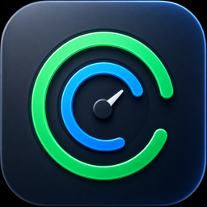

# Codex Rate Widget

Codex Rate Widget is a SwiftUI and WidgetKit app that displays your currently available Codex usage allowance in macOS desktop widgets and the menu bar.



## Requirements

- macOS 14 or later
- A recent Xcode release with Swift 6 support
- Codex CLI with an active login
- An Apple Development Team for a signed local build

## What It Shows

- Small: the remaining capacity of the primary active usage window
- Medium: the remaining capacity of the five-hour and weekly usage windows, the official weekly reset date and time remaining, and a warning lamp when weekly capacity falls materially behind a constant seven-day pace
- Large: the remaining capacity, official weekly reset schedule, and an expanded interactive chart that switches between official daily token usage and remaining-capacity history recorded on this Mac for the past 24 hours or seven days; the history chart includes a dotted constant-consumption guide for the weekly limit

The menu-bar app and large widget chart the same locally recorded seven-day remaining-capacity history. Their dotted guides repeat the current official seven-day reset cadence backward across the visible history, from 100% at each inferred cycle start to 0% at its reset. The guide is a locally calculated pace reference, not an additional official limit. Weekly rings place the current linear-pace reference beneath the actual ring, so a blue arc extends beyond the actual remaining arc whenever consumption is running ahead of that pace. When actual weekly remaining capacity is at least 10 percentage points below the current-cycle guide, the app and all widget sizes show a red warning lamp and render the actual weekly ring in red. The app chart and large widget chart also show the pause required for the descending guide to catch the observed remaining percentage as a compact day/hour/minute duration. The underlying value is rounded up to a whole minute and assumes usage is paused on every machine signed into the account. The same warning annotation gives a simple linear-regression projection for when remaining capacity would reach 0%. It uses observations within the current official seven-day cycle, requires at least eight samples spanning six hours, and reports `after reset` instead of extrapolating a date beyond the official next reset.

The app does not assume that a five-hour window always exists. If Codex does not return a window with `windowDurationMins = 300`, the app shows it as currently unavailable. If the window is restored in a future response, the ring appears again automatically.

## Data Sources

- Remaining capacity: the installed Codex CLI app server's `account/rateLimits/read` method
- Daily token usage: `account/usage/read`
- Official token usage: cumulative totals and daily buckets returned by Codex's `account/usage/read` method
- Remaining-capacity history: the host app's bounded local record of current official `account/rateLimits/read` values, sampled after successful refreshes and retained for seven days
- Weekly pace guide and warning: a local calculation from the official weekly remaining percentage, reset timestamp, and seven-day window duration

The remaining-capacity chart is not an official historical series returned by Codex. It is a local history of official current values observed by this Mac every 15 minutes while the host app is running. The chart leaves gaps when the app was not recording, retains observed jumps when a limit resets, and automatically resumes the five-hour series if Codex reports that window again. Its dotted weekly guide repeats the current official reset cadence backward across the visible history as separate 100%-to-0% cycle segments; it does not predict future Codex usage or change the official limit.

The app sends no analytics. It launches the locally installed Codex CLI, which may contact Codex services to retrieve account usage as part of its normal operation. See [PRIVACY.md](./PRIVACY.md) for the precise data and storage boundaries.

## Build and Install

The recommended approach is to ask Codex to set up the app. Open this repository in Codex and ask it to follow [INSTALL_WITH_CODEX.md](./INSTALL_WITH_CODEX.md).

Because [Apple bundle identifiers must be unique](https://developer.apple.com/documentation/xcode/preparing-your-app-for-distribution), replace the repository's unsigned `com.example.*` placeholder before making a signed build. Generate an ignored local configuration with a reverse-DNS identifier that you control:

```sh
Scripts/configure-local-signing.sh \
  --bundle-id com.yourname.CodexRateWidget \
  --team-id "YOUR_TEAM_ID"
```

The helper does not edit the Xcode project or tracked files. It writes only `Config/Local.xcconfig`, which is gitignored and included automatically by the tracked `Config/Shared.xcconfig`. The shared build settings derive every related identifier from that one local value:

- App: `com.yourname.CodexRateWidget`
- Widget extension: `com.yourname.CodexRateWidget.Widget`
- App Group: `$(TeamIdentifierPrefix)com.yourname.CodexRateWidget` in both targets

The Team ID is optional in the helper. If supplied, it is written only to the ignored local configuration. `$(TeamIdentifierPrefix)` is resolved from the signing team so the non-provisioned macOS App Group has the required `<Developer team identifier>.<group name>` form. Xcode and `xcodebuild` apply the local configuration automatically, with no extra command-line option.

The menu app and every widget size show the same compact version label, such as `v1.1.1`. The visible version and internal monotonically increasing build number both come from `Config/Shared.xcconfig`, so the app and embedded extension cannot drift when either value is updated.

To install it manually:

1. Find the Team ID for the Apple Development Team you intend to use.
2. Run `Scripts/configure-local-signing.sh` with a Bundle Identifier in your namespace and that Team ID.
3. Open [CodexRateWidget.xcodeproj](./CodexRateWidget.xcodeproj) in Xcode.
4. Run the `CodexRateWidget` scheme on My Mac. The app and widget automatically use the same local signing configuration.
5. Confirm the first successful refresh in the menu bar, then open Edit Widgets on the desktop and add the localized `Codex Remaining Capacity` widget.
6. To keep the data synchronized automatically, enable Launch at Login from the app's menu.

The app detects Codex CLI through the current `PATH`, common Homebrew and npm locations, nvm, mise, asdf, Volta, or the `CODEX_EXECUTABLE` environment variable. The app refreshes every 15 minutes, records a bounded seven-day remaining-capacity history after successful refreshes, and lets the widget read the resulting snapshot from the App Group container. Enable Launch at Login if you want the history to continue across Mac restarts and login sessions.

The repository intentionally does not contain an Apple Development Team ID, certificate, private key, or provisioning profile. Keep personal values in `Config/Local.xcconfig`; do not copy them into `project.pbxproj`, `Config/Shared.xcconfig`, or another tracked file. The local file can be deleted and regenerated at any time.

## Localization

English is the development and fallback language. Japanese translations are used when the system language is Japanese; all other system languages fall back to English.

The menu-bar app's Language control can override the system setting with English or Japanese. The selection is stored in the App Group and immediately reloads the widget, so the menu app and every widget size use the same language. System Default preserves the standard macOS behavior.

## Resource Use

The app queries the Codex app server briefly every 15 minutes and then returns to idle. It does not scan project directories, load project contents, or read the local Codex thread database. Remaining-capacity history is capped at seven days: at a 15-minute cadence it contains at most about 673 samples, with both supported windows stored in each sample.

## Privacy and Stability

The app invokes the locally installed Codex CLI but does not scan project directories, read local thread metadata, or include telemetry. The latest account snapshot and bounded remaining-capacity history remain in the configured App Group container shared by the app and widget. The Codex account methods used here are implementation interfaces and may change in future Codex CLI releases.

This is an independent, unofficial project and is not endorsed by or affiliated with OpenAI.

## Verification

Run the complete repository hygiene, localization, asset, build, and test checks with:

```sh
Scripts/verify.sh
```

The verification build uses an isolated DerivedData directory. Before launching or packaging a signed app after testing, use Xcode's Clean Build Folder command or run a signed `xcodebuild clean build`; this prevents a stale unit-test bundle from remaining inside the app.

Architecture and maintenance invariants are documented in [docs/ARCHITECTURE.md](./docs/ARCHITECTURE.md) and [AGENTS.md](./AGENTS.md). Contributions must follow [CONTRIBUTING.md](./CONTRIBUTING.md), and security reports must follow [SECURITY.md](./SECURITY.md).

Before the first commit, run `Scripts/audit-public-tree.sh`. After commits exist, run `Scripts/audit-public-history.sh`; it scans every reachable commit and ref, including raw commit and tag metadata, while reporting only safe object and path labels, never the matched values. The complete source-only publication checklist is in [docs/PUBLISHING.md](./docs/PUBLISHING.md).

## License

Released under the [MIT License](./LICENSE).
